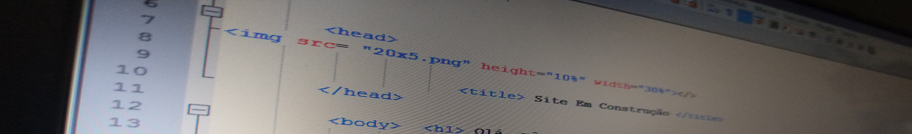

<!DOCTYPE html>

<html>

    

<h1 style="color:;"> Programando em html</h1>

 
                 
 Este é o site que eu estou criando. Como você pode ver, ele ainda está em construção. 

 <h2> Sobre o Autor Deste Site</h2>

  

Meu nome é Anderson Gomes Scarpi. Tenho 34 anos e sou brasileiro. Sou casado com Talita Gomes de Araújo SCARPI.

Tá bom agora, mô?

</body>

<!--comentário

<ul>
<li>Apartamento</li>
<li>Carro</li>
<li>Motocicleta</li>
<li>Trabalho</li> 
                </ul>-->

<ol>
<li>Apartamento</li>
<li>Carro</li>
<li>Motocicleta</li>
<li>Trabalho</li>
            </ol>

 <footer>

 Criado por Anderson G. Scarpi 
 

 E-mail: <a style="" href="mailto:andyteacher@hotmail.com"> andyteacher@hotmail.com </a> 

</footer>

</html>
